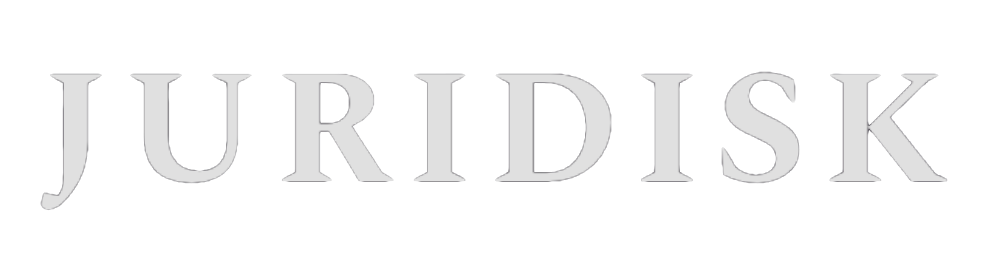
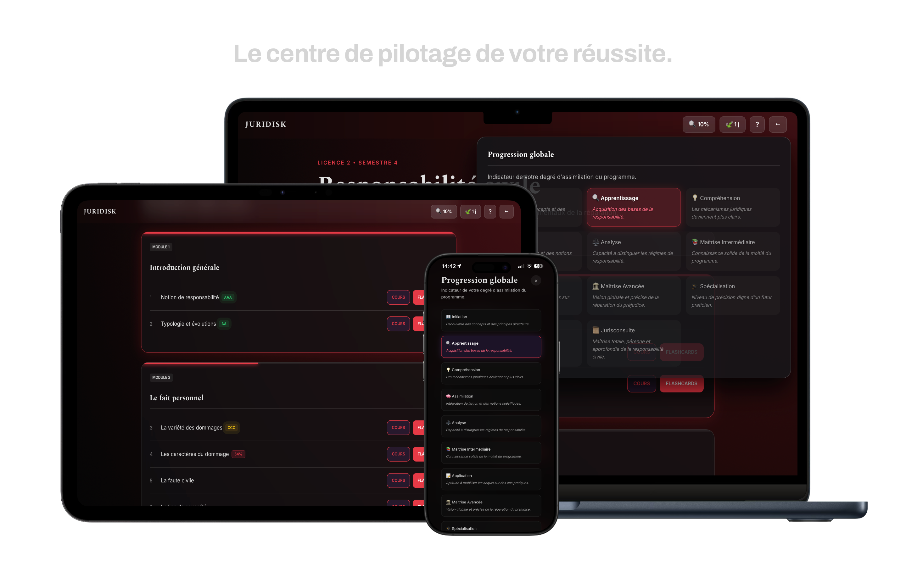
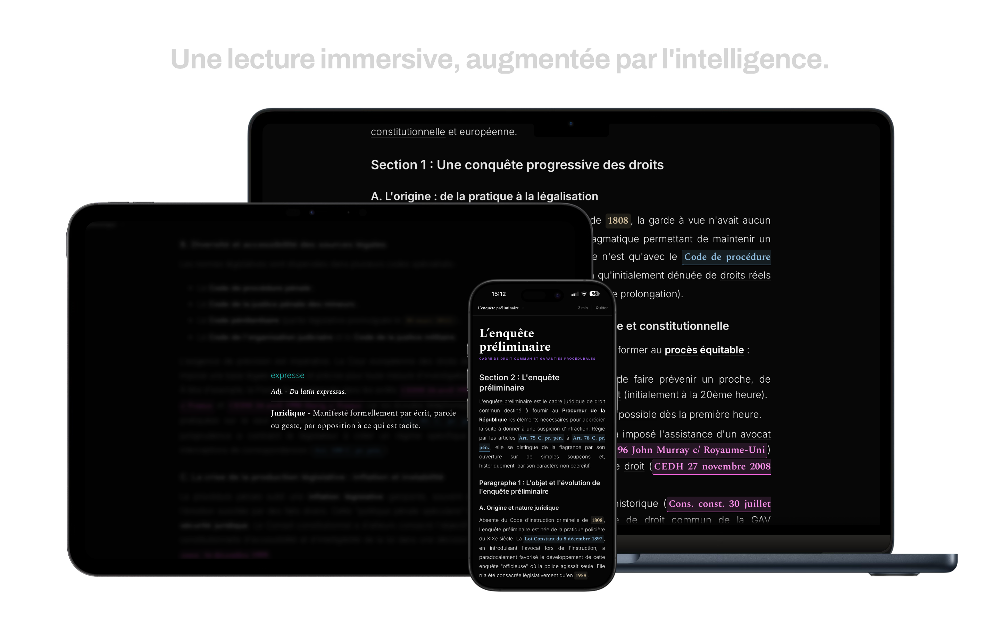
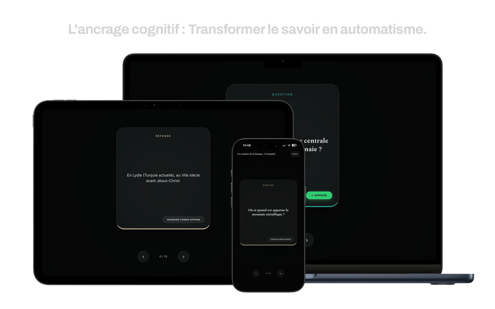
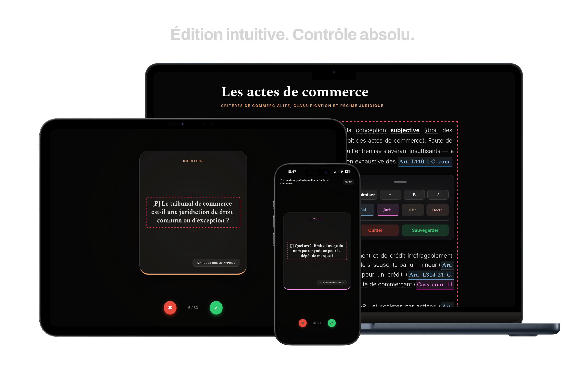
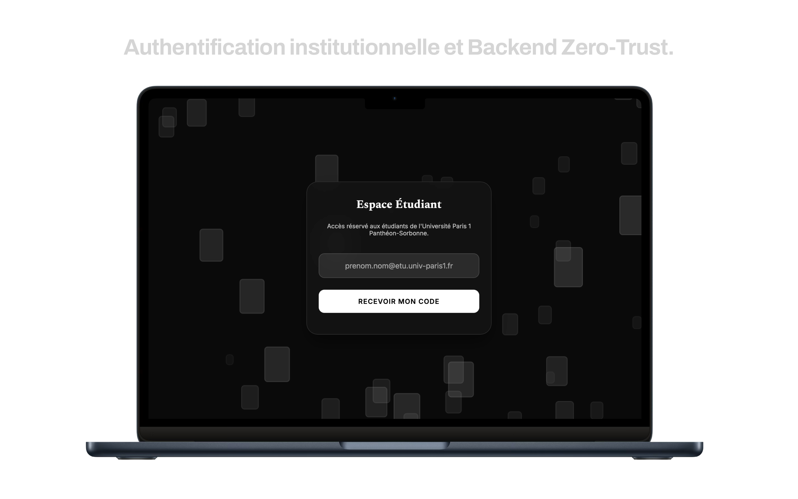

  

  **Repenser l'ingénierie pédagogique en droit.** *Un écosystème de révision intelligent, sécurisé et conçu pour l'Université Paris 1 Panthéon-Sorbonne.*
  
  
  
  
  

---

## La Vision 🏛️

Aujourd'hui, nous introduisons non pas un, mais trois outils fondamentaux pour la réussite universitaire :
1. Une liseuse documentaire augmentée.
2. Un algorithme de mémorisation basé sur la neuroplasticité.
3. Un environnement cloud strictement sécurisé pour les étudiants.

Ces trois éléments ne font qu'un. **C'est Juridisk.**

L'apprentissage du droit est exigeant, complexe et volumineux. Juridisk n'est pas un simple répertoire de fiches : c'est un **assistant pédagogique proactif**. En réduisant la friction numérique à zéro, l'application permet à l'étudiant de se concentrer exclusivement sur une chose : **la compréhension de la matière juridique.**

---

## L'Expérience Étudiante (De A à Z) 📱

### 1. Le Hub Pédagogique (Dashboard Gamifié)
L'engagement de l'étudiant est le moteur de sa réussite. Le tableau de bord de Juridisk traduit des données complexes d'apprentissage en un retour visuel instantané.

* **Neuro-ergonomie & Répétition Espacée :** Le système évalue la "vitalité de la mémoire". Un chapitre passe du statut *Initiation* (Grade D) à *Savoir Pérenne* (Grade AAA) en fonction de la régularité des révisions et de la courbe de l'oubli de l'étudiant.
* **Tracker d'Assiduité (Streak) :** Valorisation de la régularité quotidienne pour ancrer la mémorisation à long terme.

  
   <em>Le tableau de bord : Une expérience unifiée sur Desktop, Tablette et Mobile</em>

### 2. Le Moteur de Lecture Intelligent (Lesson Viewer)
Le droit requiert de la rigueur. Le moteur de rendu de Juridisk transforme un texte brut en une expérience interactive et sourcée.

* **Smart Legal Dispatcher :** Toute référence textuelle à un arrêt, une loi ou un traité est détectée. Un simple clic redirige algorithmiquement l'étudiant vers la source officielle correspondante (*Légifrance, EUR-Lex, HUDOC, Nations Unies*).
* **Glossaire Contextuel Automatisé :** L'algorithme scanne le document et surligne le vocabulaire technique. Une interaction déclenche une infobulle (sans quitter la page) affichant la définition stricte issue de la base de données.
* **Mode Immersion :** Interface épurée, typographie *Spectral* pour le confort visuel, thèmes dynamiques auto-générés selon la matière, et suivi de lecture (Scroll-Spy).

  
   <em>Interface de lecture immersive avec Smart Tooltips sur tous vos écrans</em>

### 3. Le Moteur de Mémorisation Active (Flashcards)
Pour transformer le savoir passif en réflexe juridique, Juridisk intègre un module de flashcards haute performance.

* **Catégorisation Sémantique :** Les cartes s'adaptent visuellement selon leur nature (Loi, Jurisprudence, Histoire, Doctrine) via un système de tags intelligents (`[L]`, `[J]`, etc.).
* **Ergonomie Mobile-First :** Contrôles tactiles fluides (Swipe latéral) sur smartphone, et raccourcis clavier optimisés pour les sessions intensives sur ordinateur.
* **Synchronisation Cloud :** Les résultats des sessions mettent à jour la base de données Supabase en temps réel pour ajuster le score global de l'étudiant.

  
   <em>Le module d'apprentissage actif optimisé pour la mobilité</em>

### 4. Le CMS "Invisible" (Édition Administrateur)
Pour les étudiants et professeurs, maintenir l'outil à jour ne demande aucune compétence technique ni logiciel tiers.

* **Édition WYSIWYG In-App :** Si l'utilisateur possède les droits d'administration, il peut éditer le cours ou les flashcards *directement depuis l'interface de lecture* (via `Ctrl+Shift+E` ou tapotement multiple sur l'écran).
* **Toolbar Contextuelle :** Sur mobile, les contrôles de navigation mutent dynamiquement en outils d'enregistrement et de formatage (boutons de validation) pour optimiser l'espace écran.

  
   <em>Édition en temps réel du contenu depuis n'importe quel appareil</em>

---

## Architecture, Sécurité & Conformité DSI 🔒

Juridisk a été pensé pour s'intégrer de manière transparente et sécurisée dans un environnement institutionnel. L'architecture respecte les standards les plus stricts de sécurité informatique et de protection des données (RGPD).

### 1. Authentification "Zero-Trust"
* **Accès Restreint :** Le portail d'entrée filtre cryptographiquement les accès. Seuls les utilisateurs possédant une adresse e-mail institutionnelle (`@etu.univ-paris1.fr`) peuvent recevoir un code de connexion à usage unique (Magic OTP). Aucun mot de passe n'est stocké.
* **Gestion des Sessions :** Déconnexion automatique et gestion rigoureuse des tokens JWT.

  

### 2. Intégrité des Données & Souveraineté
* **Protection XSS :** L'intégralité du contenu dynamique est traitée par `DOMPurify` avant le rendu dans le DOM, garantissant une étanchéité totale face aux failles par injection.
* **Hébergement Européen :** Les données sont hébergées via Supabase (PostgreSQL) sur les serveurs AWS situés en Irlande, respectant le cadre de souveraineté européenne.
* **Row Level Security (RLS) :** La base de données rejette nativement toute altération non autorisée. La logique de sécurité est ancrée dans le backend, empêchant toute manipulation via la console du navigateur.

### 3. Conformité RGPD & Droit à l'Oubli
* **Délégation Edge Functions :** L'application intègre une fonction Deno s'exécutant à la périphérie (Edge) permettant à tout étudiant de déclencher la **suppression immédiate et définitive** de son profil, de ses statistiques et de son authentification, en totale conformité avec les recommandations de la CNIL.

---

## Stack Technologique ⚙️

Pour garantir une vélocité maximale, un temps de chargement inférieur à 50ms et une maintenance aisée, le projet contourne volontairement les frameworks lourds (React/Vue) au profit d'une stack native pure :

* **Frontend :** Vanilla JavaScript (ES6+), HTML5 Sémantique, CSS3 Avancé (Variables dynamiques, Flexbox/Grid, Animations natives).
* **Backend :** Supabase (PostgreSQL 15, Auth OTP, Edge Functions TypeScript).
* **Déploiement :** Netlify (CDN Global) avec architecture PWA (Progressive Web App) pour installation native sur iOS/Android.

---

## Licence et Propriété Intellectuelle ⚖️

**Copyright © 2026 Juridisk — Tous droits réservés**

Le code source, la base de données et les synthèses sont la propriété de l'auteur. Le contenu est mis à disposition dans un cadre de 'fair use' (usage loyal) à des fins d'illustration pédagogique pour les étudiants de l'IED.

1. **Interdiction de reproduction :** Toute copie, redistribution ou republication du code ou du contenu est strictement interdite sans autorisation écrite préalable.
2. **Droit d'usage personnel :** Un droit d'accès gratuit est concédé aux étudiants de l'Université Paris 1 Panthéon-Sorbonne pour un usage strictement privé et pédagogique.
3. **Protection du contenu :** La structure des bases de données est protégée au titre du droit *sui generis* du producteur de base de données.
4. **Originalité des contenus :** Les ressources pédagogiques constituent des œuvres dérivées originales. Bien qu'issues d'enseignements magistraux, elles résultent d'un travail substantiel de synthèse, de restructuration et de reformulation algorithmique propre à l'auteur.
5. **Signalement de contenu :** Nous attachons une importance capitale au respect de la propriété intellectuelle. Si, malgré notre vigilance, vous constatez l'utilisation non autorisée d'un contenu, merci de nous le signaler pour un retrait immédiat.

---

  <i>Juridisk — L'innovation technologique au service de l'excellence académique.</i>

